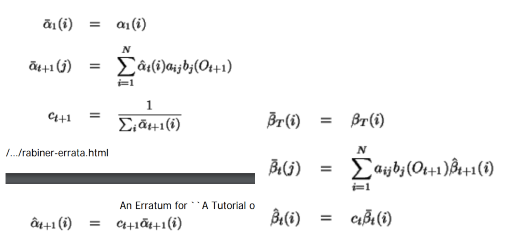
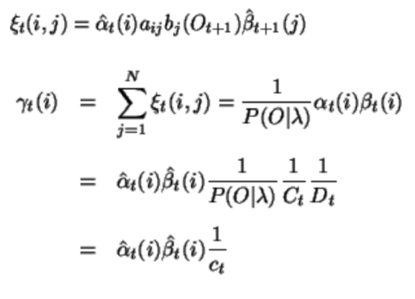
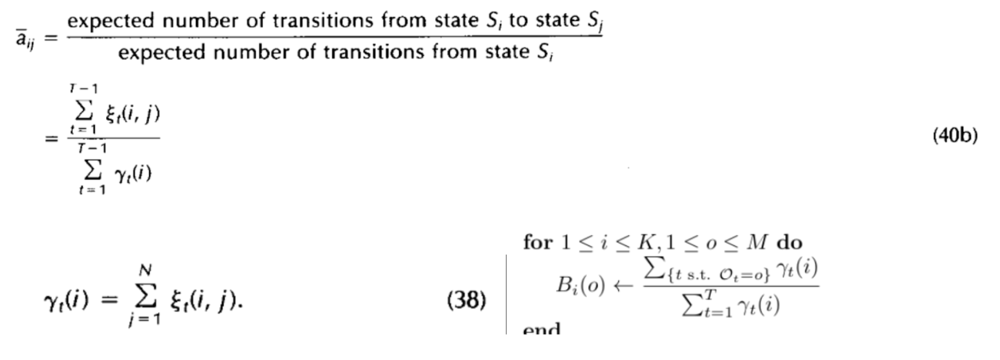
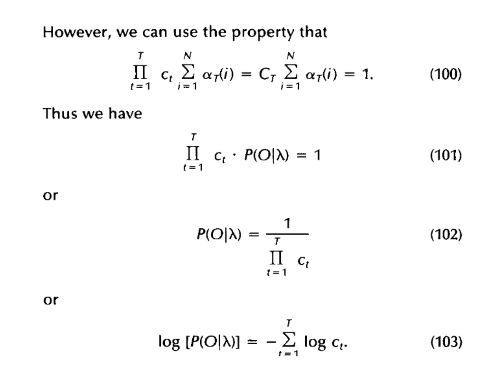
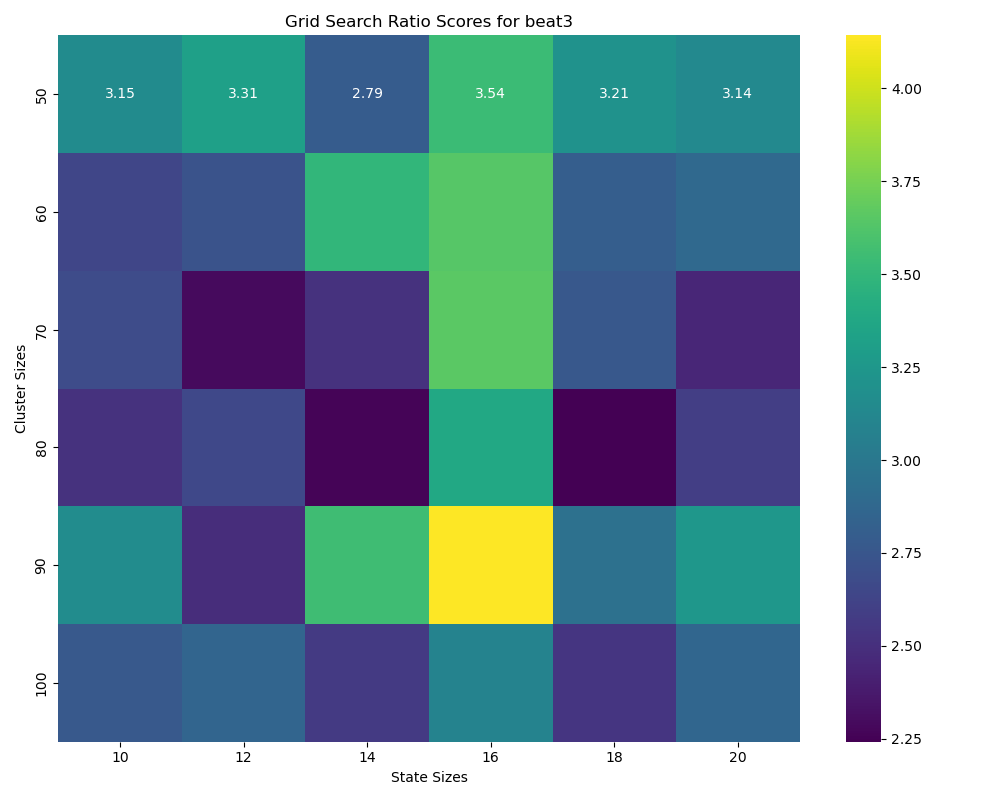
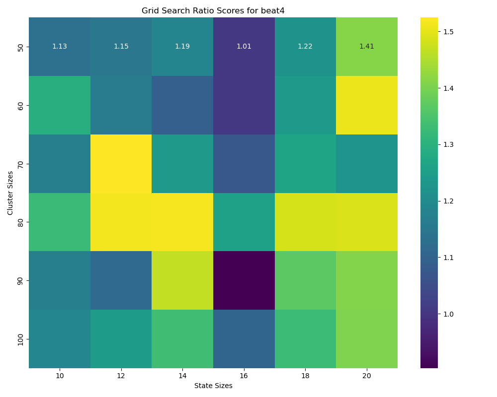

# HMM-Gesture-Recognition
Training collection of Hidden Markov Models using IMU sensor readings to recognize different arm motion gestures

## Instructions for running inference/testing
### Required packages:
- joblib (for saving/loading kmeans model)
- sklearn (for kmeans)
- numpy
<br>

### Instructions
To run the inference script, run `python test_hmm.py`. <br>
- HOWEVER, BEFORE RUNNING the script, please set the `test_directory` variable on line 16 equal to the path to the directory of test images. When running test_hmm.py, the predictions of this model will be written to `test_hmm_predicitons.txt`. <br>

## Introduction
For this project, I used IMU sensor readings from gyroscopes and accelerometers to train a collection of Hidden Markov Models (HMM) via Baum-Welch in numpy that could recognize different arm motion gestures. I then wrote inference code to classify unknown arm motions in real-time on new data using these pre-trained models. 

Developing and efficiently training an accurate HMM model in numpy required not only planning and hypothesizing in advance, but also required investing time into understanding the math and statistical reasoning underlying the Baum-Welch algorithm and its variants, such as that in the paper by Lawrence Rabiner: [A Tutorial on Hidden Markov Models and Selected Applications in Speech Recognition](https://www.cs.ubc.ca/~murphyk/Bayes/rabiner.pdf), and its [Erratum](https://dl.icdst.org/pdfs/files3/93a4bc705f6afe148018dcfee66a9217.pdf).

Among the various issues to tackle throughout this project, some of the defining challenges were: 
1) Correctly following the *Baum-Welch algorithm and its Rabiner variants* in implementation 
2) Addressing *underflow issues* while maintaining optimized training/prediction speed
3) Finding good *hyperparameters and initializations* that distinguished closely related (but different) gestures

My implementation and optimizations aim to effectively address these challenges, among others. While some issues had more anticipated effects or solutions, others turned out to be less obvious.

## Files included:
- `test_hmm.py`: the test script to be run
- `vis_and_quant.ipynb`: This notebook preprocesses training data, trains and saves Kmeans models on the data to quantize the IMU data, and also creates visualizations of the input data
- `hmm_train.ipynb`: file for training one HMM model for each gesture class. Predictions on validation set are also done in here.
- `hmm_train_grid_search.ipynb`: file for training many HMM models simultaneously for grid search over Emission and State hyperparameters
- `HMM-models/`: a folder containing any saved HMMs as .pkl files
- `Kmeans-models/`: a folder containing any saved Kmeans classifiers as .pkl files

IMU data is not my own to disperse, so I do not include it in the repo.

## Implementation Details and Analysis
### Visualization and Quantization of IMU data
All my code for quantization and visualization of the data pretraining is written in `vis_and_quant.ipynb`.
The first thing I did after loading the training data in IMU-train was make 3d plots of the Gyroscope and Accelerometer data for each .txt file (See Appendix A for a subsample of the visualizations). From these, the first thing that became clear was that beat3 and beat4 were likely going to be the hardest to distinguish from each other. Based on this, I made a note to put a lot of weight on how well my future models would distinguish between these two gestures.

For training, for each gesture type, I concatenated the k-means emissions outputs among the files for that gesture in IMU-train. I then used these concatenated sequences as the input data for training my HMM models for each class. I then used the *IMU-train-additional* files for validation.

For quantization, I used k-means clustering on the 6 IMU dimensions (excluding time in milliseconds of course) to quantize the data, concatenating all the data in *IMU-train* for fitting the k-means clusters. I used the Kmeans class from sklearn.cluster for my implementation. I made six k-means models, with 50, 60, 70, 80, 90, and 100 clusters respectively. Following clustering, I made histograms to see how evenly the models split up the data, noting that there were a few expected high-count clusters that remained (See Appendix B).

In order to get a better prior expectation of what my transition matrix (A) should look like at the end of training, I also created histograms to visualize how long observations (aka emissions classes) would repeat before changing to a different emission class (for example, a sequence snippet with [...38, 23, 23, 23, 23, 72, 72, 4, …] would have one count of 4 for the 23 portion and one count of 2 for the 72 portion) (See Appendix C for histograms). Generally, all the histograms seem to resemble a poisson distribution, apart from a spike near 1. The low values spike probably has to do with outliers and the fact that all the data in *IMU-train* was concatenated in making this histogram.

### Implementing HMM training
My training is done in `hmm_train.ipynb` and `hmm_train_gridsearch.ipynb`. The former focuses on training one model (for each class) at a time and inspection of the algorithm and results, while the latter focuses on performing grid search across many cluster sizes and hidden state sizes for hyperparameter selection, though there is a lot of overlapping code.

For training, for each gesture type, I concatenated the k-means emissions outputs among the files for that gesture in *IMU-train*. I then used these concatenated sequences as the input data for training my HMM models for each class. I then used the *IMU-train-additional* files for validation.

I set my **π** to be 1 on state 0 and 0 everywhere else, and I initialized my emission probabilities (**B**) as all *1 / (# of clusters)*. I defined *A[i, j]* as the probability of transitioning from state i to state j, so I initialized:


- A[i, i] = 0.9
- A[i, (i + 1) % # of states] = 0.1
- The rest as 0

This ensures my HMM was *left-to-right* and looped back to the first state. I also tried a 0.99 and 0.1 split, but it didn't seem to make much difference - in both cases *A[i, (i + 1) % # of states]* would converge to values mostly between 0.15 and 0.03, as mentioned earlier.

The first choice I had to make in training my HMMs was how I would address **underflow issues** when storing extremely low probabilities. I used the Rabiner scaling method in the [paper](https://www.cs.ubc.ca/~murphyk/Bayes/rabiner.pdf), and its [Erratum](https://dl.icdst.org/pdfs/files3/93a4bc705f6afe148018dcfee66a9217.pdf); I also found I could leverage the efficiency of matrix multiplication and numpy broadcasting using their methods. This choice was certainly challenging when deciding between different implementation/formula/notation Rabiner paper, and Erratum, but was overall very rewarding from a learning perspective. 

For the *scaled forward and backward steps*, I relied on these equations in the Erratum:


For the *scaled e-step*, I used these equations in the erratum as my basis for calculating gamma and Xi:


For the m-step, no change is technically required due to scaling, but for updating transition matrix A I use the equation in the Rabiner paper, which uses gamma in the denominator rather than the version with Xi (though they are equivalent). B is shown in the bottom right:


Because of my use of matrix multiplication and broadcasting with numpy arrays in my scaled Baum-Welch implementation, **I was able to train an HMM model for each gesture with 30 epochs in under 25 seconds in total**. The log likelihood training curves can be found in Appendix D.

I trained for 30 epochs, though training generally flattened after 5-10 epochs. I found slight gains in training log likelihood could be attained up to 200 epochs, but these gains often came at the cost of overfitting and would cause one of beat3 or beat4 to dominate in classification during validation.

### Implementing HMM Evaluation and Hyperparameter Optimization

For scoring for prediction/classification of validation and test data, I was at first unsure the best way to calculate the log-likelihood of a input sequence using the scaled alphas. However, the Rabiner paper had a useful identity for calculating the log likelihood via the scaling factors in the forward pass:


Thus, I implemented my scaled forward function to also return the log-likelihood using this formula.

I wanted to experiment with different cluster sizes and state sizes, particularly to see how well I could classify *beat3* and *beat4* gestures. Since my training algorithm was quite time efficient, I created an additional notebook (`hmm_train_gridsearch.ipynb`) to perform a **grid search** over 6 hidden state sizes and 6 observation cluster sizes in the recommended ranges.

At first, I mapped raw log-likelihood of each the validation files on the correct HMMs. However, this method obviously was not a useful indicator of how well the models differentiated gestures, and it also was biased towards models with smaller cluster sizes (which have inherently smaller LL). In particular, I wanted to target hyperparameters/models that could differentiate between beat3 and beat4 well, based on my pretraining 3d visualizations I mentioned earlier. Therefore, I came up with a **“ratio score”** method to compare models: I calculated *(LL of the best scoring incorrect gesture / LL of the correct gesture)* - since these values are negative, a higher ratio is associated with a better model performance. All of my Ratio score grid search heatmaps can be found in Appendix E.

## Results
I wanted to select a model that was based on my data-driven heuristics (i.e. my grid search). Going back to my grid search, I want to focus on beat3 and beat4:



Across all my models and gestures, there was only one misclassification on validation:
```
Incorrect prediction for M = 90 and S = 16! 
Expected: beat4 	 Actual: beat3
```
This also happened to be the model that performed best for beat3, meaning that there was a tradeoff between prediction accuracy on beat3 and beat4 in my models. Therefore, I wanted to select a model that 1) had a better average prediction on each beat and didn’t overfit, and also 2) was a model in a region of the grid with a “wide” local minimum rather than a “narrow” one (similar to how SGD picks a good minimum). I decided to go with **cluster size = 80 and state size = 20** for my final "best" model (though I think most of these models would do fine).

A couple additional takeaways I had during training and eval:
- I found (partially through still having correct predictions with a flawed A) that the A matrix had minor changes in training as long as initialization was good. It seems that B is what changes the most and carries the weight of the model. My grid search seemed to favor large state sizes, but I think this was only to give B more ways of expressing emissions probabilities: For example, if a “swinging down” state of a gesture took a long time/ portion of the sequence, instead of changing the transition probability of A at state 3 to adjust for this, the HMM model would prefer to just make the emission probabilities of state 3 and 4 similar, artificially making this “swinging down state” longer.
- I also found that it was not smart to train for too many epochs: I found slight gains in training log likelihood could be attained up to 200 epochs, but these gains often came at the cost of overfitting and would cause one of beat3 or beat4 to dominate in classification during validation.

